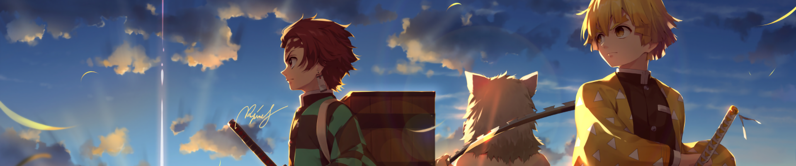

<h1 align="center">Hi 👋, I'm Owais</h1>

<h3 align="center">
  BSc. Aerospace Engineering Student @ Orta Doğu Teknik Üniversitesi | 
  <!-- ADD RESUME LINK -->
  <a href="" target="_blank">Resume</a>
</h3>

<h1 align="left"><picture></picture> Projects</h1>

<table>
  <thead>
    <tr>
      <th>Name</th>
      <th>Description</th>
      <th>Languages/Tools</th>
    </tr>
    <tr>
      <td colspan="3">
        
<i>Use CTRL + click to open links in new tab. </i>

      </td>
    </tr>
  </thead>
  <tbody>
    <!-- <tr> ... ONE PROJECT ... </tr> DUPLICATE FOR EVERY PROJECT-->
    <tr>
      <td><a href="https://github.com/SCORPIA2004/CampusConnect">Campus Connect</a></td>
      <td>A social webapp that connects students together <a href="https://www.figma.com/file/R8BZfCFKQJQwLtaQgkhAHL/Undefined?type=design&node-id=107%3A2&mode=design&t=aNN8YGzyDwz2Z1lV-1" target="blank">Figma</a> | <a href="https://youtu.be/J5G0Qc4Uwq0">Demo</a></td>
      <td>MongoDB | ExpressJS | React | NodeJS</td>
    </tr>
</tbody>
</table>

<h2></picture>Connect with me</h2>

<h3 align="left">Languages and Tools:</h3>

 
   

